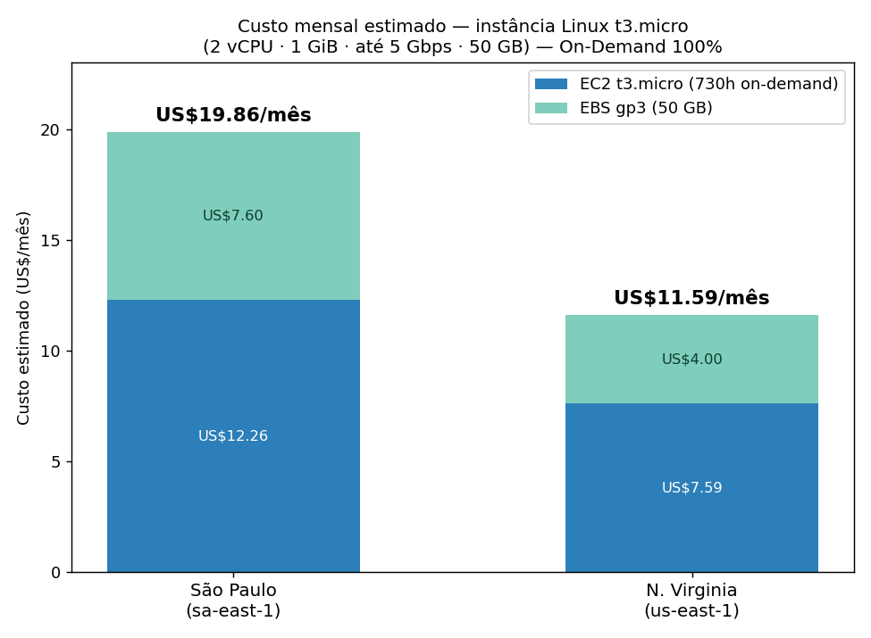
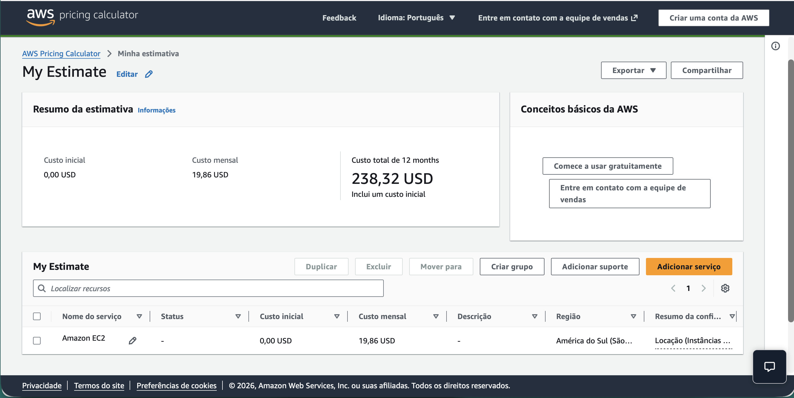
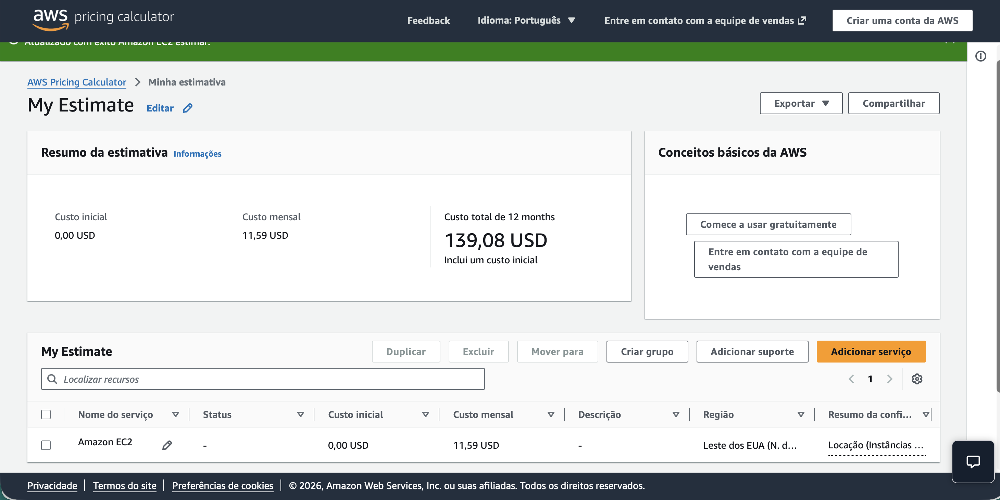

# FIAP - Faculdade de Informática e Administração Paulista

<p align="center">
<a href= "https://www.fiap.com.br/"></a>
</p>

<br>

# FarmTech Solutions - Fase 5

## Nome do grupo

**FarmTech Solutions**

## 👨‍🎓 Integrantes

* Karina Garta Szewczuk - RM569309
* Maria Sabrina Feitosa da Silva - RM568714
* Nicolas Lima Apolinário - RM570741
* Roger Gabriel de Souza Jesus Costa - RM573659

## 👩‍🏫 Professores

### Tutor(a)

* Sabrina Otoni

### Coordenador(a)

* André Godói

## 📜 Descrição

A FarmTech Solutions atende uma fazenda de médio porte, com aproximadamente 200 hectares e diferentes culturas agrícolas. Nesta fase, o trabalho foi dividido em duas entregas obrigatórias.

Na Entrega 1, usamos a base `crop_yield.csv` para analisar o comportamento das variáveis, identificar tendências de produtividade por clusterização, verificar possíveis outliers e treinar cinco modelos de regressão para prever o rendimento da safra.

O notebook Jupyter contém a análise exploratória completa, comentários no código, interpretação dos gráficos, clusterização com K-Means, identificação de outliers, preparação dos dados, validação cruzada, comparação de cinco algoritmos de regressão e análise das métricas MAE, MSE, RMSE e R². Também incluímos um baseline simples para interpretar melhor o desempenho dos modelos.

Na Entrega 2, usamos a AWS Pricing Calculator para comparar o custo de uma infraestrutura Linux simples nas regiões de São Paulo e Virgínia do Norte. A configuração considerada foi uma instância `t3.micro`, com 2 vCPUs, 1 GiB de memória, rede de até 5 Gbps e 50 GB de armazenamento EBS gp3, no modelo On-Demand com 100% de utilização.

A cotação resultou em aproximadamente US$ 19,86 por mês em São Paulo e US$ 11,59 por mês em N. Virginia. Apesar do menor custo da região norte-americana, escolhemos São Paulo para o cenário apresentado, considerando a necessidade de acesso rápido aos dados dos sensores e a restrição do enunciado para armazenamento no exterior.

## 📁 Estrutura de pastas

Dentre os arquivos e pastas presentes na raiz do projeto, definem-se:

* `.github`: arquivos de configuração específicos do GitHub. Nesta fase, a pasta fica preparada para futuros workflows ou templates.
* `assets`: imagens, gráficos e capturas de tela usadas na documentação.
* `config`: arquivos de configuração e parâmetros do projeto. Nesta fase, não foi necessário adicionar configurações externas.
* `document`: documentos complementares do projeto. A subpasta `other` fica reservada para materiais adicionais.
* `scripts`: scripts auxiliares para automações, deploy ou tarefas específicas. Nesta fase, a execução principal é feita pelo notebook.
* `src`: código-fonte e arquivos necessários para a execução da solução nesta fase.
* `README.md`: documentação introdutória e guia geral do projeto.

A estrutura principal ficou assim:

```text
.
├── .github/
├── assets/
│   ├── aws_custo_comparativo.png
│   ├── aws_sao_paulo.png
│   ├── aws_virginia.png
│   ├── clusters_pca.png
│   ├── comparacao_modelos.png
│   ├── correlacao_pooled.png
│   ├── correlacao_por_cultura.png
│   ├── dispersao.png
│   ├── elbow_silhueta.png
│   ├── real_vs_previsto.png
│   └── yield_by_crop.png
├── config/
├── document/
│   └── other/
├── scripts/
├── src/
│   ├── MariaSabrinaFeitosaDaSilva_rm568714_pbl_fase5.ipynb
│   └── crop_yield.csv
├── .gitattributes
├── .gitignore
└── README.md
```

## Entrega 1 - Machine Learning

A análise completa está no notebook:

**Notebook Jupyter:** [Abrir notebook](src/MariaSabrinaFeitosaDaSilva_rm568714_pbl_fase5.ipynb)

**Vídeo demonstrativo da Entrega 1:** [(https://youtu.be/y9yYa7zq5eM)]

O notebook reúne a análise exploratória da base, a comparação das culturas, as correlações, a clusterização com K-Means, a busca por outliers e a modelagem supervisionada com cinco algoritmos.

Os modelos avaliados foram Regressão Linear, Árvore de Decisão, Random Forest, Gradient Boosting e KNN Regressor. A avaliação considera validação cruzada e as métricas MAE, MSE, RMSE e R².

## Entrega 2 - Computação em Nuvem

A configuração cotada na AWS foi uma instância Linux `t3.micro`, com 2 vCPUs, 1 GiB de memória, rede de até 5 Gbps e 50 GB de armazenamento EBS gp3.

| Item | São Paulo (sa-east-1) | N. Virginia (us-east-1) |
| --- | ---: | ---: |
| EC2 `t3.micro` | US$ 12,26/mês | US$ 7,59/mês |
| EBS gp3, 50 GB | US$ 7,60/mês | US$ 4,00/mês |
| **Total mensal** | **US$ 19,86** | **US$ 11,59** |



### Cotação em São Paulo



### Cotação em N. Virginia



A Virgínia do Norte custa US$ 8,27 a menos por mês. Tomando São Paulo como referência, isso representa uma economia de aproximadamente 41,6%.

Mesmo com a diferença de preço, escolhemos São Paulo para o cenário proposto. Como os sensores e os usuários estão no Brasil, a região brasileira tende a oferecer menor latência. Além disso, o enunciado estabelece uma restrição para armazenamento no exterior, então São Paulo atende diretamente a essa condição.

**Vídeo demonstrativo da Entrega 2:** [(https://youtu.be/3w8HqhKzCds)]

## 🔧 Como executar o código

### Pré-requisitos

Para executar o projeto, é necessário ter Python 3, Jupyter Notebook e as bibliotecas `pandas`, `numpy`, `scikit-learn`, `matplotlib` e `seaborn`.

### Passo a passo

No macOS ou Linux, abra o terminal na raiz do repositório e execute:

```bash
# Cria um ambiente virtual para manter as bibliotecas do projeto separadas.
python3 -m venv .venv

# Ativa o ambiente virtual.
source .venv/bin/activate

# Instala as bibliotecas usadas no projeto.
python3 -m pip install pandas numpy scikit-learn matplotlib seaborn jupyter

# Abre o Jupyter Notebook.
python3 -m jupyter notebook
```

Quando o Jupyter abrir no navegador, entre na pasta `src` e selecione:

```text
MariaSabrinaFeitosaDaSilva_rm568714_pbl_fase5.ipynb
```

Depois use a opção **Restart & Run All** para executar o notebook inteiro.

O arquivo `crop_yield.csv` deve permanecer na mesma pasta `src`, ao lado do notebook.

No Windows, a ativação do ambiente virtual é feita com:

```bash
.venv\Scripts\activate
```

## 🗃 Histórico de lançamentos

* 0.5.0 - 08/09/2026 - Fase 5: Machine Learning e Computação em Nuvem
* 0.4.0 - Fase 4: versão anterior do projeto FarmTech Solutions

## 📋 Licença

MODELO GIT FIAP por FIAP está licenciado sob Attribution 4.0 International.
